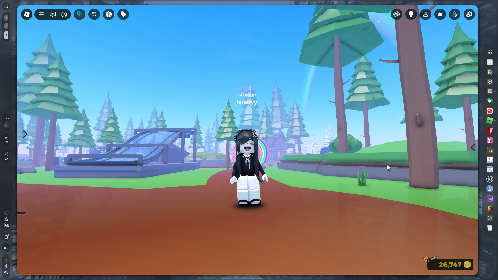
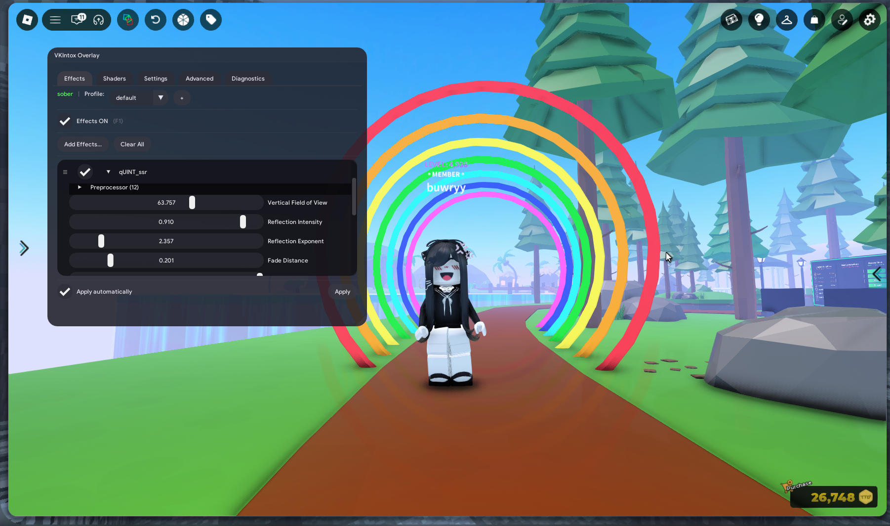
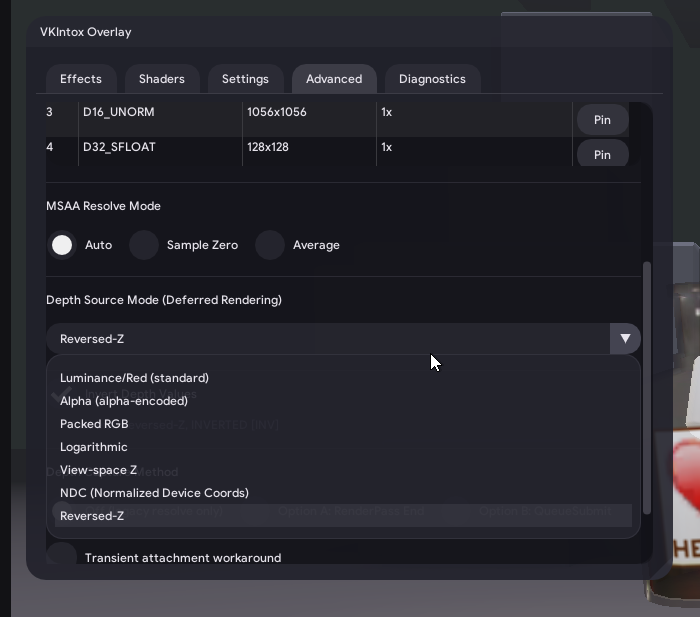

# VKIntox

[](./LICENSE)
[](https://nixos.org)

An independent fork of vkShade, which fixes the issues with depth buffers that vkBasalt, and inherently, vkShade have.

### As shown here:





To set it up for Sober, run `./setup_sober.sh`

## Features

The base project, vkBasalt required editing config files and restarting. vkShade, inheriting vkBasalt, didn't have depth resolve modes. VKIntox added:

- **A nicer in-game overlay** (activated via HOME by default)
- **Multiple depth buffer resolve modes** and automatic picking
- **A specialized setup for [Sober](https://vinegarhq.org/Home/index.html)**, an Android runtime that allows running Roblox on Linux

These help form a post effects processing experience just like ReShade, but accessible to Linux.

### Depth Buffer

The layer automatically picks a depth buffer that fits the game window, which in almost all cases works perfectly.
If misconfigured, for Roblox, the depth resolve mode should be Reverse-Z and inversion should be ON.

### ReShade Shader Support

This project, thanks to vkBasalt, supports ReShade .fx files with compilation into Spir-V. However, you must note that some shaders may fail to work.
## Usage

### Prerequisites:
- **A game that uses Vulkan**, and doesn't refuse Vulkan layers (rare, but is possible. DXVK or vkd3d might break VKIntox.)
- **When running `setup_sober.sh`**, you'll need: `python3`, `curl`, `unzip` (all checked by the setup script).

The `setup_sober.sh` script:
- Fetches org.gnome.Sdk if necessary
- Compiles the project locally
- Installs it as a local Flatpak repo and Vulkan Layer extension
- Enables it via ENABLE_VKINTOX=1 env variable
- Deploys shader manager configurations and all ReShade shaders

To install for other Flatpak games:
- Run `just flatpak-build`
- Add environment variable `ENABLE_VKINTOX=1` for the game you want VKIntox on
- Optionally, copy shaders that `setup_sober.sh` fetches

To install for native games:
- Install: GCC with versions above 9; Meson, Ninja; Vulkan headers; SPIR-V headers; glslangValidator; X11 + Xi development files; wayland-client, wayland-protocols, wayland-scanner; libxkbcommon.
- Run this to fetch, compile and install:
```bash
git clone https://github.com/buwryme/VKIntox.git
cd VKIntox
meson setup --buildtype=release --prefix=/usr build-release
ninja -C build-release
sudo ninja -C build-release install
```

### Key Bindings

| Key | Default | Description |
|-----|---------|-------------|
| Toggle Effects | `End` | Enable/disable all effects |
| Reload Config | `F10` | Reload configuration and recompile shaders |
| Toggle Overlay | `Home` | Show/hide the overlay GUI |

### Known Issues/Info

- Initial restart after first launch with VKIntox is required for depth buffer to work
- Effects, outside the ones already installed, might fail
- Startup may sometimes take long due to deferred reboot workaround
- Having graphics settings set to Automatic or switching between graphics qualities could cause crashes

**If depth-dependent effects look wrong, please open the Advanced tab and try changing between depth resolve modes, which after each one, you press F10 (or your set keybind) to reload. Also try pressing Force re-detect when changing depth buffer settings.

### Disclaimer

**Use at your own risk**: 
- Unstable shaders or extreme GPU load can crash or freeze games;
- VKIntox is driver-level but can still get you moderated;
- This is a very experimental project that has yet to improve.

#### ⚠️ Please open an issue if **anything** goes wrong, as long as it is indefinitely VKIntox's fault.

### Special Thanks To
slobodaapl, for making **vkShade** which is the direct source code reprise of this project

DadSchoorse, for making vkBasalt, which the original **vkShade** is based on
